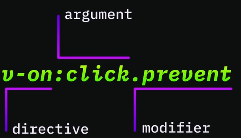
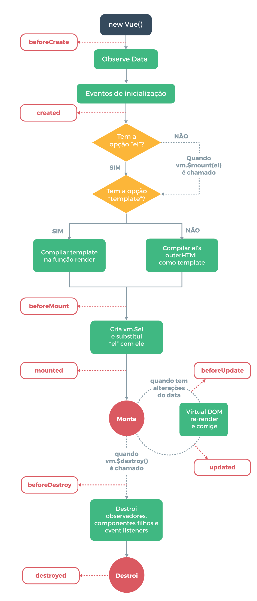
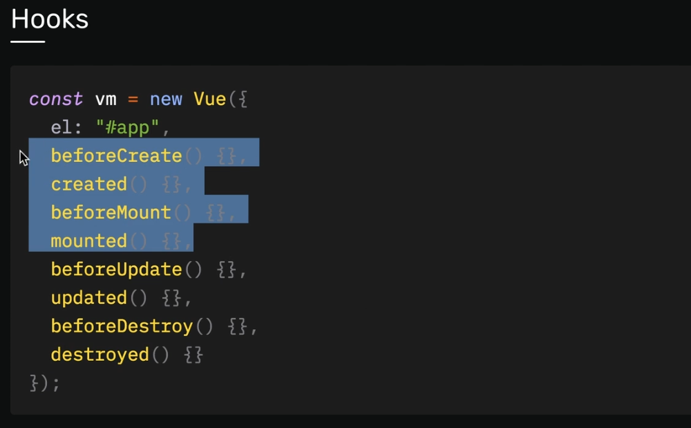
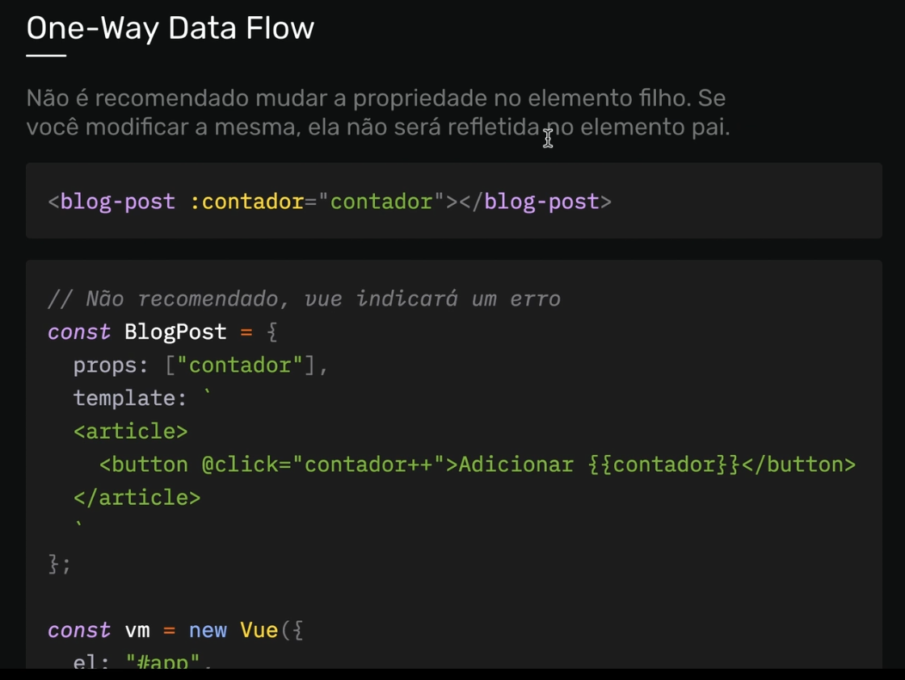

# Curso de VUE/VUEX

Restartando projeto Junho/2021

## <a name="indice">Índice</a>

1. [Vue.JS](#parte1)     
2. [Vue para iniciantes](#parte2)     
3. [Directivas e Hooks](#parte3)     
4. [Techno Projeto](#parte4)     
5. [Componentes](#parte5)     
6. [Animações](#parte6)     
7. [Vue Router](#parte7)     
8. [Vuex](#parte8)     
9. [Projeto Final](#parte9)     
10. [Considerações Finais](#parte10)     
---

## <a name="parte1">Vue.JS</a>

- [01-Vue-JS/0104-instalacao-do-vuejs.html](01-Vue-JS/0104-instalacao-do-vuejs.html)

```vue

<div id="app">
    {{nome}}, {{idade}}, {{faculdade.curso}}
</div>
<script>
    /*    options = {
            el: "#app",
            data: {
                nome: "José",
                idade: 35,
                faculdade: {
                    possui: "sim",
                    curso: "Analista de sistemas"
                }
            }
        }*/

    const vm = new Vue(
        {
            el: "#app",
            data: {
                nome: "José",
                idade: 35,
                faculdade: {
                    possui: "sim",
                    curso: "Analista de sistemas"
                }
            }
        }
    );
    console.log(vm);
</script>

```

- [01-Vue-JS/0105-reatividade-e-virtual-dom.html](01-Vue-JS/0105-reatividade-e-virtual-dom.html)

```vue

<div id="comercio">
    <p>Bermudas - R$ <span>{{preco}}</span></p>
    <button @click="total++">Adicionar</button>
    <button @click="total--">Remover</button>
    <span>{{total}}</span>
    <p>Total: <span>{{preco * total}}</span></p>
</div>

<div>
    <p>Camisas - R$ <span class="preco"></span></p>
    <button class="adicionar">Adicionar</button>
    <button class="remover">Remover</button>
    <span class="total"></span>
    <p>Total: <span class="precoTotal"></span></p>
</div>

<script>
    const vm = new Vue({
        el: "#comercio",
        data: {
            preco: 69,
            total: 0
        }
    });

    const dados = {
        preco: 49,
        total: 0
    }

    const preco = document.querySelector(".preco");
    const total = document.querySelector(".total");
    const precoTotal = document.querySelector(".precoTotal");
    const adicionar = document.querySelector(".adicionar");
    const remover = document.querySelector(".remover");

    preco.innerText = dados.preco;
    total.innerText = dados.total;
    precoTotal.innerText = dados.preco * dados.total;

    function incrementar() {
        dados.total++;
        atualizarUI();
    }

    function diminuir() {
        dados.total--;
        atualizarUI();
    }

    function atualizarUI() {
        total.innerText = dados.total;
        precoTotal.innerText = dados.total * dados.preco;
    }

    adicionar.addEventListener("click", incrementar);
    remover.addEventListener("click", diminuir);
</script>

```

- [01-Vue-JS/0106-template-e-diretivas.html](01-Vue-JS/0106-template-e-diretivas.html)

```vue

<div id="app">
    <h1>{{titulo}}</h1>
    <div v-show="comprou" :style="{background: cor}">
        <p>{{conteudo}}</p>
        <p>{{lado * lado - lado / 100}}</p>
        <p>{{comprou ? 'Sim ele Comprou' : 'Não comprou, compre aqui'}}</p>
        <input v-model="cor" type="color">
        {{cor}}
    </div>
    <a :href="comprou ? href : ''">{{href}}</a>
</div>
<script>
    new Vue({
        el: "#app",
        data: {
            titulo: "Curso de JavaScript",
            conteudo: "Esse é o conteúdo",
            lado: 5,
            comprou: true,
            href: "https://www.josemalcher.net",
            cor: "#333"
        }
    })
</script>

```

[Voltar ao Índice](#indice)

---


## <a name="parte2"> Vue para iniciantes</a>

- [02-Vue-para-iniciantes/0201-instancia-aula.html](02-Vue-para-iniciantes/0201-instancia-aula.html)
- [02-Vue-para-iniciantes/0201-instancia-exerc.html](02-Vue-para-iniciantes/0201-instancia-exerc.html)

```vue
<div id="app">
    {{nomeProduto}}
</div>
<script src="../lib/vue.js"></script>
<script>
    function VueClone(options) {
        this.options = options;
        this.$el = document.querySelector(options.el);
        this.data = options.data;
    }

    const vmClone = new VueClone({
        el: "#app",
        data: {
            nome: "Martelo",
        }
    });
    console.log(vmClone);

    const vm = new Vue({
        el: "#app",
        data: {
            instrumento: "Violão",
            cor: "Vermelho"
        },
        computed: {
            nomeProduto() {
                setTimeout(() => {
                    console.log('This do timeout:', this.instrumento);
                }, 1000)
                return this.instrumento + ' ' +  this.cor;
            }
        }
    });
    console.log(vm);

</script>
```

- [02-Vue-para-iniciantes/0202-data-aula.html](02-Vue-para-iniciantes/0202-data-aula.html)
- [02-Vue-para-iniciantes/0202-data-exerc.html](02-Vue-para-iniciantes/0202-data-exerc.html)

```vue
<div id="app">
    {{logado}}
</div>
<script src="../lib/vue.js"></script>
<script>
    const vm = new Vue({
        el: "#app",
        data: {
            logado: ""
        }
    })

    setTimeout(() => {
        vm.logado = "Sim"
    }, 1000);
</script>
```

- [02-Vue-para-iniciantes/0203-methods-aula.html](02-Vue-para-iniciantes/0203-methods-aula.html)
- [02-Vue-para-iniciantes/0203-methods-exerc.html](02-Vue-para-iniciantes/0203-methods-exerc.html)

```vue

<div id="app">
    {{total}}
    <button @click="incrementar">Incrementar</button>
    <button @click="diminuir">Diminuir</button>
    <p>{{instrumento}}</p>
    <button @click="mudarNome('Violão')">Violão</button>
    <button @click="mudarNome('Guitarra')">Guittara</button>
    <button @click="verEvento">Evento</button>
</div>
<script src="../lib/vue.js"></script>
<script>
    const vm = new Vue({
        el: "#app",
        data: {
            total: 0,
            instrumento: ""
        },
        methods: {
            incrementar() {
                this.total++
                this.teste();
            },
            diminuir() {
                this.total--
                this.teste();
            },
            mudarNome(instrumento) {
                this.instrumento = instrumento;
            },
            verEvento(event) {
                console.log(event)
            },
            teste() {
                console.log("Método ativado")
            }
        }
    })
</script>

```

- [02-Vue-para-iniciantes/0204-v-bind-aula.html](02-Vue-para-iniciantes/0204-v-bind-aula.html)
- [02-Vue-para-iniciantes/0204-v-bind-exerc.html](02-Vue-para-iniciantes/0204-v-bind-exerc.html)

```vue

<div id="app">
    <a :href="link">Link Google</a>
    <p :class="cor" class="ativo">Texto</p>
    <p :class="comprou ? liberar : naoliberar">O cliente comprou?</p>
</div>
<script src="../lib/vue.js"></script>
<script>
    const vm = new Vue({
        el: "#app",
        data: {
            link: "https://www.google.com",
            cor: "azul",
            liberar: "verde",
            naoliberar: "vermelho",
            comprou: false,
        }
    })
</script>

```

- [02-Vue-para-iniciantes/0205-v-on-aula.html](02-Vue-para-iniciantes/0205-v-on-aula.html)
- [02-Vue-para-iniciantes/0205-v-on-exerc.html](02-Vue-para-iniciantes/0205-v-on-exerc.html)

```vue

<div id="app">
  <button @click="contador++">Clique Aqui</button>
  {{contador}}
  <button @click="ativo = !ativo">Toggle</button>
  <p v-if="ativo">Mostrar texto</p>
  {{ativo}}
  <a href="#interno" @click.prevent.once="handleClick">Link Interno</a>
  <input type="text" @keyup.enter="handleClick">
  <p @mousemove="handleMove">Esse é o mouse x: {{mouse.x}}</p>
</div>
<script src="../lib/vue.js"></script>
<script>
  const vm = new Vue({
    el: "#app",
    data: {
      contador: 0,
      ativo: true,
      mouse: ""
    },
    methods: {
      handleClick(event) {
        console.log(event.key);
      },
      handleMove(event) {
        this.mouse = event;
      }
    }
  })
</script>

```

- [02-Vue-para-iniciantes/0206-v-if-aula.html](02-Vue-para-iniciantes/0206-v-if-aula.html)
- [02-Vue-para-iniciantes/0206-v-if-exerc.html](02-Vue-para-iniciantes/0206-v-if-exerc.html)

```vue
<div id="app">
    <p v-if="logado">Usuário está logado.</p>
    <p v-show="logado">Usuário está logado.</p>
</div>
<script src="../lib/vue.js"></script>
<script>
    const vm = new Vue({
        el: "#app",
        data: {
            logado: true
        }
    })
</script>
```

- [02-Vue-para-iniciantes/0207-v-html-e-v-text-aula.html](02-Vue-para-iniciantes/0207-v-html-e-v-text-aula.html)
- [02-Vue-para-iniciantes/0207-v-html-e-v-text-exerc.html](02-Vue-para-iniciantes/0207-v-html-e-v-text-exerc.html)

```vue
<div id="app">
  <div v-html="link"></div>
  
  <p>{{fruta}} custa R$ 20</p>
  <p v-text="fruta">custa R$ 20</p>

  <p v-once>Valor inicial: R$ {{total - gasto}}</p>
  <button @click="gasto += 5">Comprar Banana R$ 5</button>
  <p>Total gasto: R$ {{gasto}}</p>
  <p>Valor final: R$ {{total - gasto}}</p>
</div>
<script src="../lib/vue.js"></script>
<script>
  const vm = new Vue({
    el: "#app",
    data: {
      link: "<a href='https://www.origamid.com'>Origamid</a>",
      fruta: "<b>Banana</b>",
      total: 150,
      gasto: 20
    },
  })
</script>
```

- [02-Vue-para-iniciantes/0208-v-for-aula.html](02-Vue-para-iniciantes/0208-v-for-aula.html)
- [02-Vue-para-iniciantes/0208-v-for-exerc.html](02-Vue-para-iniciantes/0208-v-for-exerc.html)
- [02-Vue-para-iniciantes/0208-v-for-exerc-cep.html](02-Vue-para-iniciantes/0208-v-for-exerc-cep.html)

```vue
<div id="app">
    <div v-html="link"></div>

    <p>{{fruta}} custa R$ 20</p>
    <p v-text="fruta">custa R$ 20</p>

    <p v-once>Valor inicial: R$ {{total - gasto}}</p>
    <button @click="gasto += 5">Comprar Banana R$ 5</button>
    <p>Total gasto: R$ {{gasto}}</p>
    <p>Valor final: R$ {{total - gasto}}</p>
</div>
<script src="../lib/vue.js"></script>
<script>
    const vm = new Vue({
        el: "#app",
        data: {
            link: "<a href='https://www.origamid.com'>Origamid</a>",
            fruta: "<b>Banana</b>",
            total: 150,
            gasto: 20
        },
    })
</script>
```

- [02-Vue-para-iniciantes/0209-computed-e-watch-aula.html](02-Vue-para-iniciantes/0209-computed-e-watch-aula.html)
- [02-Vue-para-iniciantes/0209-computed-e-watch-exerc.html](02-Vue-para-iniciantes/0209-computed-e-watch-exerc.html)
- [02-Vue-para-iniciantes/0209-computed-e-watch-exerc-2.html](02-Vue-para-iniciantes/0209-computed-e-watch-exerc-2.html)
- [02-Vue-para-iniciantes/0209-computed-e-watch-exerc-cep.html](02-Vue-para-iniciantes/0209-computed-e-watch-exerc-cep.html)

```vue
<div id="app">
    <ul>
        <li v-for="carro in carrosAzuis">
            {{carro.marca}}
        </li>
        <button @click="removerCarro">Remover</button>

        <p>{{contador}}</p>
        <button @click="contador++">Adicionar</button>
    </ul>
</div>
<script src="../lib/vue.js"></script>
<script>
    const vm = new Vue({
        el: "#app",
        data: {
            contador: 0,
            carros: [
                {
                    marca: "VW",
                    cor: "Azul"
                },
                {
                    marca: "Ford",
                    cor: "Preto"
                },
                {
                    marca: "Tesla",
                    cor: "Azul"
                }
            ]
        },
        computed: {
            carrosAzuis() {
                return this.carros.filter(({cor}) => cor === "Azul");
            }
        },
        methods: {
            removerCarro() {
                this.carros.pop();
            }
        },
        watch: {
            contador(valorNovo, valorAntigo) {
                console.log(valorNovo);
                console.log(valorAntigo);
            },
            carros(valorNovo, valorAntigo) {
                console.log(valorNovo);
            }
        }
    });
</script>
```


[Voltar ao Índice](#indice)

---


## <a name="parte3"> Directivas e Hooks</a>

- 

- [03-Directivas-e-Hooks/0302-class-e-style.html](03-Directivas-e-Hooks/0302-class-e-style.html)
- [03-Directivas-e-Hooks/0302-class-e-style-exerc.html](03-Directivas-e-Hooks/0302-class-e-style-exerc.html)

```html
<!DOCTYPE html>
<html lang="en">
<head>
    <meta charset="UTF-8">
    <title>03 Diretivas e Hooks</title>
    <style>
        .vermelho {
            background: red;
        }

        .azul {
            color: blue;
        }

        .verde {
            color: green;
        }

        .ativo {
            background: red;
        }
    </style>
</head>
<body>
<div id="app">
    <p :class="[cor, {ativo: estaAtivo}]">Texto Azul</p>
    <p :class="{ativo: estaAtivo, verde: elementoVerde}">Mostrar texto</p>
    <button @click="estaAtivo = !estaAtivo">Click</button>

    <a :style="{background: bgColor, fontSize: tamanho + 'px'}">Estilize Ele</a>
    <button @click="tamanho++">Aumentar</button>

    <p :style="estiloBotao">Novo Texto</p>
    <p :style="estiloParagrafo">Novo Texto</p>

    {{estiloParagrafo}}
</div>

<script src="../lib/vue.js"></script>
<script>
    const vm = new Vue({
        el: "#app",
        data: {
            cor: "verde",
            background: "vermelho",
            estaAtivo: false,
            elementoVerde: false,
            bgColor: "tomato",
            tamanho: 20,
            estiloBotao: {
                background: "tomato",
                fontSize: "20px",
                color: "#fff"
            }
        },
        computed: {
            estiloParagrafo() {
                const tamanho = Math.random() * 100;
                return {
                    fontSize: tamanho + 'px',
                }
            }
        }
    });
</script>
</body>
</html>
```

- [03-Directivas-e-Hooks/0303-v-model-aula.html](03-Directivas-e-Hooks/0303-v-model-aula.html)
- [03-Directivas-e-Hooks/0303-v-model-btn.html](03-Directivas-e-Hooks/0303-v-model-btn.html)
- [03-Directivas-e-Hooks/0303-v-model-exerc.html](03-Directivas-e-Hooks/0303-v-model-exerc.html)

```html
<div id="app">
    <input v-model.lazy="nome"/><br>
    <input v-model.trim="email"/>
    <br>
    <input type="text" v-model.number="ano">
    {{ano}}
    <br>

    <input type="checkbox" id="receberEmail" v-model="receberEmail">
    <label for="receberEmail">Receber Email</label>
    {{receberEmail}}
    <p>nome: {{nome}}</p>
    <p>email: {{email}}</p>

    <div>
        <input type="radio" name="azul" id="azul" v-model="cor" value="Azul">
        <label for="azul">Azul</label>
        <input type="radio" name="vermelho" id="vermelho" v-model="cor" value="Vermelho">
        <label for="vermelho">Vermelho</label>
        <input type="radio" name="verde" id="verde" v-model="cor" value="Verde">
        <label for="verde">Verde</label>

        {{cor}}


    </div>

    <div>
        <select v-model="fruta">
            <option disabled value="">Selecione uma Fruta</option>
            <option value="banana">Banana</option>
            <option value="morango">Morango</option>
            <option value="uva">Uva</option>
        </select>
        {{fruta}}
    </div>
</div>

<script src="../lib/vue.js"></script>
<script>
    const vm = new Vue({
        el: "#app",
        data: {
            nome: "José Malcher",
            email: "contato@josemalcher.net",
            receberEmail: true,
            cor: "",
            fruta: "",
            ano: 0
        }
    });
</script>
```

- [03-Directivas-e-Hooks/0304-v-on-e-eventos-globais-aula.html](03-Directivas-e-Hooks/0304-v-on-e-eventos-globais-aula.html)

```html
<div id="app">
    <p style="position: fixed;">{{totalScroll * 20}}</p>
</div>

<script src="../lib/vue.js"></script>
<script>
    const vm = new Vue({
        el: "#app",
        data: {
            totalScroll: 0,
        },
        methods: {
            handleScroll(event) {
                console.log(event);
                if (event.key === "Enter") {
                    this.totalScroll = window.scrollY;
                }
            }
        },
        created() {
            window.addEventListener("keyup", this.handleScroll);
        }
    });
</script>
```





- [03-Directivas-e-Hooks/0305-lifecycle-hooks-aula.html](03-Directivas-e-Hooks/0305-lifecycle-hooks-aula.html)

```html
<div id="app">
    <p>{{mensagem}}</p>
    <div>{{github}}</div>
    <button @click="puxarGithub">Puxar Github</button>
</div>

<script src="../lib/vue.js"></script>
<script>
    const vm = new Vue({
        el: "#app",
        data: {
            mensagem: "Essa é uma mensagem",
            github: {},
        },
        methods: {
            puxarGithub() {
                fetch("https://api.github.com/users/josemalcher")
                    .then(r => r.json())
                    .then(r => {
                        this.github = r;
                    })
            }
        },
        beforeCreate() {
            console.log(this.mensagem);
        },
        created() {
            this.puxarGithub();
            console.log(this.mensagem);
            console.log("Elemento", this.$el)
        },
        beforeMount() {
            console.log("BeforeMount", this.mensagem)
            console.log("Elemento", this.$el)

        },
        mounted() {
            console.log("Elemento", this.$el)
        }
    });
</script>
```

- [03-Directivas-e-Hooks/0305-lifecycle-hooks-aula-2.html](03-Directivas-e-Hooks/0305-lifecycle-hooks-aula-2.html)

```html

<div id="app">
    <button @click="contador++">Total: {{contador}}</button>
    <button @click="destruir">Destruir</button>
</div>

<script src="../lib/vue.js"></script>
<script>
    const vm = new Vue({
        el: "#app",
        data: {
            contador: 0,
        },
        methods: {
            destruir() {
                this.$destroy();
            }
        },
        beforeUpdate() {
            console.log("teste");
        },
        updated() {
            console.log("teste updateds");
        },
        beforeDestroy() {
            console.log("Vai destruir");
        },
        destroyed() {
            console.log("Destruiu");
        }
    });
</script>
```

- [03-Directivas-e-Hooks/0305-lifecycle-hooks-exerc.html](03-Directivas-e-Hooks/0305-lifecycle-hooks-exerc.html)

```html
<div id="app">
    <button @click="contador++">Adicionar {{contador}}</button>
    <ul>
        <li v-for="(valor, chave) in github">{{chave}}: {{valor}}</li>
    </ul>
</div>

<script src="../lib/vue.js"></script>
<script>
    const vm = new Vue({
        el: "#app",
        data: {
            github: {},
            contador: 0,
        },
        methods: {
            puxarGithub() {
                fetch("https://api.github.com/users/josemalcher")
                    .then(r => r.json())
                    .then((resposta) => {
                        this.github = resposta
                    })
            }
        },
        updated() {
            document.title = this.contador;
        },
        created() {
            this.puxarGithub();
        }
    });
</script>
```


[Voltar ao Índice](#indice)

---


## <a name="parte4"> Techno Projeto</a>

- [04-Techno-Projeto/index.html](04-Techno-Projeto/)

[Voltar ao Índice](#indice)

---


## <a name="parte5"> Componentes</a>

- [05-Componentes/0501-componentes-basico-aula/0501-componentes-basico.html](05-Componentes/0501-componentes-basico-aula/0501-componentes-basico.html)

```html
<div id="app">
    {{mensagem}}
    <botao-contador></botao-contador>
    <botao-contador></botao-contador>
    <botao-contador></botao-contador>
</div>
<script src="../../lib/vue.js"></script>
<script>
    Vue.component('BotaoContador', {
        data() {
            return {
                total: 0,
            };
        },
        template: `
          <button @click="total++">Contar: {{total}}</button>`,
        // methods: {
        //     mostrarCondole(){
        //         console.log('ATIVOU')
        //     }
        // }
    });


    const vm = new Vue({
        el: "#app",
        data: {
            mensagem: "isso em VM DATA",
        }
    });
</script>
```

- [05-Componentes/0501-componentes-basico-aula/0501-componentes-basico-local-global.html](05-Componentes/0501-componentes-basico-aula/0501-componentes-basico-local-global.html)

```html
<div id="app">
    <!--<componente-global></componente-global>-->
    <componente-local></componente-local>
    <componente-local2></componente-local2>
    <!--<componente-local3></componente-local3>-->
</div>
<script src="../../lib/vue.js"></script>
<script>

    const ComponenteLocal = {
        name: 'ComponenteLocal',
        data() {
            return {
                contar: 20
            }
        },
        template: `
          <div>
          <p>Isso é LOCAL - {{ contar }}</p>
          <p>Isso é LOCAL - {{ contarDobro }}</p>
          </div>`,
        computed: {
            contarDobro() {
                return this.contar * 2;
            }
        }
    }

    const ComponenteLocal2 = {
        name: 'ComponenteLocal',
        template: `<div>
                    <p>Isso é LOCAL 2 E mais Global: </p>
                    <componente-global></componente-global>
                    <componente-local3></componente-local3>
                    </div>`
    }

    const ComponenteLocal3 = {
        name: 'ComponenteLocal',
        template: `<div>
                    <p>Isso é LOCAL 3 </p>
                    </div>`
    }

    Vue.component('ComponenteGlobal', {
        template: `<p>Isso é GLOBAL</p>`
    });

    Vue.component('ComponenteLocal3',ComponenteLocal3);

    const vm = new Vue({
        el: "#app",
        data: {},
        components: {
            ComponenteLocal: ComponenteLocal,
            ComponenteLocal2,
            //ComponenteLocal3,
        }
    });
</script>
```

- [05-Componentes/0501-componentes-basico-aula/0501-componentes-basico-module.html](05-Componentes/0501-componentes-basico-aula/0501-componentes-basico-module.html)
  
```html
<div id="app">
    <botao-contador></botao-contador>
    <botao-contador></botao-contador>
    <botao-contador></botao-contador>
    <menu-principal></menu-principal>
</div>
<script src="../../lib/vue.js"></script>

<script type="module">

    import BotaoContadorMod from "./BotaoContador.js"

    Vue.component("BotaoContador", BotaoContadorMod)

    import MenuPrincipal from "./MenuPrincipal.js";

    Vue.component('MenuPrincipal', MenuPrincipal);

    const vm = new Vue({
        el: "#app",
        data: {
            mensagem: "isso em VM DATA",
        }
    });
</script>
```

- [05-Componentes/0501-componentes-basico-aula/BotaoContador.js](05-Componentes/0501-componentes-basico-aula/BotaoContador.js)
  
```javascript
/*
const BotaoContadorMod = {
    name: "BotaoCotnador",
    template: `<button>Contador</button>`

}

export default BotaoContadorMod;
*/
export default {
    name: "BotaoCotnador",
    data() {
        return {
            total: 0,
        }
    },
    template: `<button @click="total++">Contador Module {{ total }}</button>`

}
```

- [05-Componentes/0501-componentes-basico-aula/MenuPrincipal.js](05-Componentes/0501-componentes-basico-aula/MenuPrincipal.js)

```javascript
import BotaoContador from "./BotaoContador.js";

export default {
    name: "MenuPrincipal",
    template: `
        <ul>
            <li>Home</li>
            <li>Menu</li>
            <botao-contador></botao-contador>
        </ul>
    `,
    components: {
        BotaoContador
    }
}
```

- [05-Componentes/0501-componentes-basico-aula-exerc](05-Componentes/0501-componentes-basico-aula-exerc)

```html
<!--
  Crie uma tela com 3 diferentes Componentes.

  1 - Mostre o tempo do dia usando a API:
  https://www.metaweather.com/api/location/455825/ (Código do Rio de Janeiro)

  2 - Mostre a relação dolar/real
  https://api.exchangeratesapi.io/latest?base=USD

  3 - Mostre o valor de mercado da Apple (marketCap)
  https://api.iextrading.com/1.0/stock/aapl/quote

  Crie os componentes em arquivos separados e utilize import/export
  O componente 1 deve ser registrado globalmente
  O componente 2 deve ser registrado localmente dentro do componente 3.
  O componente 3 deve ser registrado localmente da instância Vue.js
 -->
<div id="app">
    <tempo-hoje></tempo-hoje>
    <acao-hoje></acao-hoje>

</div>

<script src="../../lib/vue.js"></script>

<script type="module">
    import TempoHoje from "./componentes/TempoHoje.js";
    import AcaoHoje from "./componentes/AcaoHoje.js";

    Vue.component("TempoHoje", TempoHoje);

    const vm = new Vue({
        el: "#app",
        components: {
            AcaoHoje
        }
    })
</script>

</script>
```

- [05-Componentes/0502-props-aula.html](05-Componentes/0502-props-aula.html)

```html

<div id="app">

    <p>Acesso direto {{ lista }}</p>

<lista-produtos
        :frutas="lista"
        titulo="FRUTAS Título Não Dinâmico"
></lista-produtos>

</div>

<script src="../lib/vue.js"></script>

<script type="module">

    const ItemProduto = {
        name: "ItemProduto",
        props: ["nomeFruta", "total"],
        props:{
            nomeFruta: String,
            total: [Number, String],
            cor: {
                type: String,
                required: true
            },
            tamanho: {
                type: String,
                default: "Grande"
            }
        },
        template: `
            <li>
                <h2>{{nomeFruta}}</h2>
                Esse é o nome: {{nomeFruta}}
                <p>{{total}}</p>
                <p>{{cor}}</p>
                <p>{{tamanho}}</p>
            </li>
        `,
    }

    const ListaProdutos = {
        name: "ListaProdutos",
        props: ["frutas", "titulo"],
        template: `
            <ul>
                <p>{{titulo}}</p>
                <p>No Modulo {{frutas}}</p>
<!--                <li v-for="fruta in frutas">{{fruta}}</li>        -->
<!--                <item-produto :nomeFruta="frutas"></item-produto> -->
                <item-produto
                    v-for="(fruta, index) in frutas"
                    :key="fruta+index"
                    :nomeFruta="fruta"
                    cor="AZUL"
                    tamanho="pequeno"
                    :total="20"
                ></item-produto>
            </ul>
        `,
        components:{
            ItemProduto
        }
    };


    const vm = new Vue({
        el: "#app",
        data: {
          lista: ['Banan', 'Uva', 'Laranja'],
        },
        components: {
            ListaProdutos
        }
    })

</script>
```



- [05-Componentes/0502-props-aula_2.html](05-Componentes/0502-props-aula_2.html)

```html

<div id="app">
    <botao-contador :valor="0"></botao-contador>
</div>

<script src="../lib/vue.js"></script>

<script type="module">

    const BotaoContador = {
        name: "BotaoContador",
        props: {
            valor: Number,
        }, data(){
            return{
                valorAtual: this.valor
            }
        },
        template: `
            <button @click="valorAtual++">Esse é o Valor Atual {{valorAtual}}</button>
        `,
    }


    const vm = new Vue({
        el: "#app",
        data:{
            total: 0
        },
        components: {
            BotaoContador
        }
    })
</script>
```

- [05-Componentes/0502-props-aula_exerc.html](05-Componentes/0502-props-aula_exerc.html) 

---


[Voltar ao Índice](#indice)

---


## <a name="parte6"> Animações</a>


[Voltar ao Índice](#indice)

---


## <a name="parte7"> Vue Router</a>


[Voltar ao Índice](#indice)

---


## <a name="parte8"> Vuex</a>


[Voltar ao Índice](#indice)

---


## <a name="parte9"> Projeto Final</a>


[Voltar ao Índice](#indice)

---


## <a name="parte10"> Considerações Finais</a>


[Voltar ao Índice](#indice)

---

