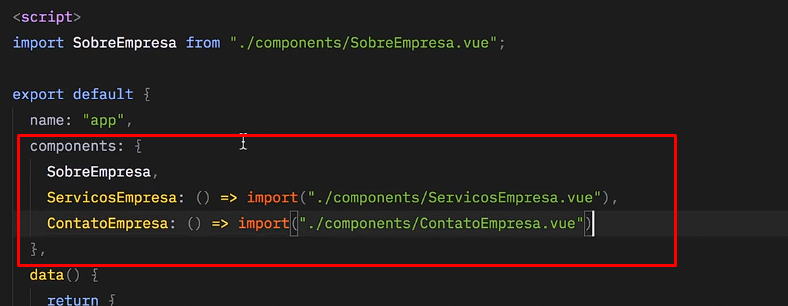
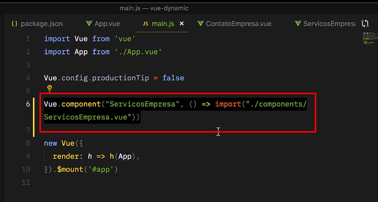
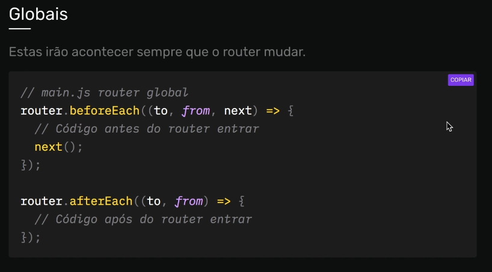
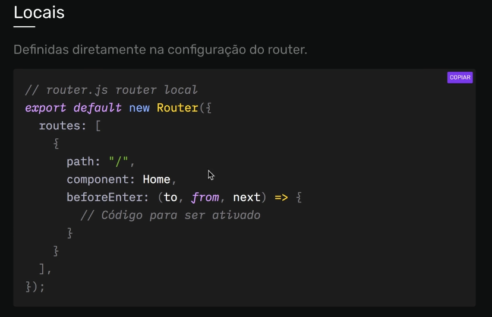
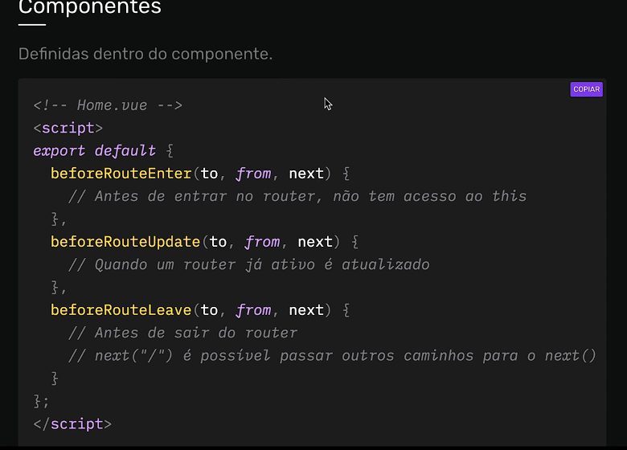

# Curso de VUE/VUEX

Restartando projeto Junho/2021

## <a name="indice">Índice</a>

1. [Vue.JS](#parte1)     
2. [Vue para iniciantes](#parte2)     
3. [Directivas e Hooks](#parte3)     
4. [Techno Projeto](#parte4)     
5. [Componentes](#parte5)     
6. [Animações](#parte6)     
7. [Vue Router](#parte7)     
8. [Vuex](#parte8)     
9. [Projeto Final](#parte9)     
10. [Considerações Finais](#parte10)     
---

## <a name="parte1">Vue.JS</a>

- [01-Vue-JS/0104-instalacao-do-vuejs.html](01-Vue-JS/0104-instalacao-do-vuejs.html)

```vue

<div id="app">
    {{nome}}, {{idade}}, {{faculdade.curso}}
</div>
<script>
    /*    options = {
            el: "#app",
            data: {
                nome: "José",
                idade: 35,
                faculdade: {
                    possui: "sim",
                    curso: "Analista de sistemas"
                }
            }
        }*/

    const vm = new Vue(
        {
            el: "#app",
            data: {
                nome: "José",
                idade: 35,
                faculdade: {
                    possui: "sim",
                    curso: "Analista de sistemas"
                }
            }
        }
    );
    console.log(vm);
</script>

```

- [01-Vue-JS/0105-reatividade-e-virtual-dom.html](01-Vue-JS/0105-reatividade-e-virtual-dom.html)

```vue

<div id="comercio">
    <p>Bermudas - R$ <span>{{preco}}</span></p>
    <button @click="total++">Adicionar</button>
    <button @click="total--">Remover</button>
    <span>{{total}}</span>
    <p>Total: <span>{{preco * total}}</span></p>
</div>

<div>
    <p>Camisas - R$ <span class="preco"></span></p>
    <button class="adicionar">Adicionar</button>
    <button class="remover">Remover</button>
    <span class="total"></span>
    <p>Total: <span class="precoTotal"></span></p>
</div>

<script>
    const vm = new Vue({
        el: "#comercio",
        data: {
            preco: 69,
            total: 0
        }
    });

    const dados = {
        preco: 49,
        total: 0
    }

    const preco = document.querySelector(".preco");
    const total = document.querySelector(".total");
    const precoTotal = document.querySelector(".precoTotal");
    const adicionar = document.querySelector(".adicionar");
    const remover = document.querySelector(".remover");

    preco.innerText = dados.preco;
    total.innerText = dados.total;
    precoTotal.innerText = dados.preco * dados.total;

    function incrementar() {
        dados.total++;
        atualizarUI();
    }

    function diminuir() {
        dados.total--;
        atualizarUI();
    }

    function atualizarUI() {
        total.innerText = dados.total;
        precoTotal.innerText = dados.total * dados.preco;
    }

    adicionar.addEventListener("click", incrementar);
    remover.addEventListener("click", diminuir);
</script>

```

- [01-Vue-JS/0106-template-e-diretivas.html](01-Vue-JS/0106-template-e-diretivas.html)

```vue

<div id="app">
    <h1>{{titulo}}</h1>
    <div v-show="comprou" :style="{background: cor}">
        <p>{{conteudo}}</p>
        <p>{{lado * lado - lado / 100}}</p>
        <p>{{comprou ? 'Sim ele Comprou' : 'Não comprou, compre aqui'}}</p>
        <input v-model="cor" type="color">
        {{cor}}
    </div>
    <a :href="comprou ? href : ''">{{href}}</a>
</div>
<script>
    new Vue({
        el: "#app",
        data: {
            titulo: "Curso de JavaScript",
            conteudo: "Esse é o conteúdo",
            lado: 5,
            comprou: true,
            href: "https://www.josemalcher.net",
            cor: "#333"
        }
    })
</script>

```

[Voltar ao Índice](#indice)

---


## <a name="parte2"> Vue para iniciantes</a>

- [02-Vue-para-iniciantes/0201-instancia-aula.html](02-Vue-para-iniciantes/0201-instancia-aula.html)
- [02-Vue-para-iniciantes/0201-instancia-exerc.html](02-Vue-para-iniciantes/0201-instancia-exerc.html)

```vue
<div id="app">
    {{nomeProduto}}
</div>
<script src="../lib/vue.js"></script>
<script>
    function VueClone(options) {
        this.options = options;
        this.$el = document.querySelector(options.el);
        this.data = options.data;
    }

    const vmClone = new VueClone({
        el: "#app",
        data: {
            nome: "Martelo",
        }
    });
    console.log(vmClone);

    const vm = new Vue({
        el: "#app",
        data: {
            instrumento: "Violão",
            cor: "Vermelho"
        },
        computed: {
            nomeProduto() {
                setTimeout(() => {
                    console.log('This do timeout:', this.instrumento);
                }, 1000)
                return this.instrumento + ' ' +  this.cor;
            }
        }
    });
    console.log(vm);

</script>
```

- [02-Vue-para-iniciantes/0202-data-aula.html](02-Vue-para-iniciantes/0202-data-aula.html)
- [02-Vue-para-iniciantes/0202-data-exerc.html](02-Vue-para-iniciantes/0202-data-exerc.html)

```vue
<div id="app">
    {{logado}}
</div>
<script src="../lib/vue.js"></script>
<script>
    const vm = new Vue({
        el: "#app",
        data: {
            logado: ""
        }
    })

    setTimeout(() => {
        vm.logado = "Sim"
    }, 1000);
</script>
```

- [02-Vue-para-iniciantes/0203-methods-aula.html](02-Vue-para-iniciantes/0203-methods-aula.html)
- [02-Vue-para-iniciantes/0203-methods-exerc.html](02-Vue-para-iniciantes/0203-methods-exerc.html)

```vue

<div id="app">
    {{total}}
    <button @click="incrementar">Incrementar</button>
    <button @click="diminuir">Diminuir</button>
    <p>{{instrumento}}</p>
    <button @click="mudarNome('Violão')">Violão</button>
    <button @click="mudarNome('Guitarra')">Guittara</button>
    <button @click="verEvento">Evento</button>
</div>
<script src="../lib/vue.js"></script>
<script>
    const vm = new Vue({
        el: "#app",
        data: {
            total: 0,
            instrumento: ""
        },
        methods: {
            incrementar() {
                this.total++
                this.teste();
            },
            diminuir() {
                this.total--
                this.teste();
            },
            mudarNome(instrumento) {
                this.instrumento = instrumento;
            },
            verEvento(event) {
                console.log(event)
            },
            teste() {
                console.log("Método ativado")
            }
        }
    })
</script>

```

- [02-Vue-para-iniciantes/0204-v-bind-aula.html](02-Vue-para-iniciantes/0204-v-bind-aula.html)
- [02-Vue-para-iniciantes/0204-v-bind-exerc.html](02-Vue-para-iniciantes/0204-v-bind-exerc.html)

```vue

<div id="app">
    <a :href="link">Link Google</a>
    <p :class="cor" class="ativo">Texto</p>
    <p :class="comprou ? liberar : naoliberar">O cliente comprou?</p>
</div>
<script src="../lib/vue.js"></script>
<script>
    const vm = new Vue({
        el: "#app",
        data: {
            link: "https://www.google.com",
            cor: "azul",
            liberar: "verde",
            naoliberar: "vermelho",
            comprou: false,
        }
    })
</script>

```

- [02-Vue-para-iniciantes/0205-v-on-aula.html](02-Vue-para-iniciantes/0205-v-on-aula.html)
- [02-Vue-para-iniciantes/0205-v-on-exerc.html](02-Vue-para-iniciantes/0205-v-on-exerc.html)

```vue

<div id="app">
  <button @click="contador++">Clique Aqui</button>
  {{contador}}
  <button @click="ativo = !ativo">Toggle</button>
  <p v-if="ativo">Mostrar texto</p>
  {{ativo}}
  <a href="#interno" @click.prevent.once="handleClick">Link Interno</a>
  <input type="text" @keyup.enter="handleClick">
  <p @mousemove="handleMove">Esse é o mouse x: {{mouse.x}}</p>
</div>
<script src="../lib/vue.js"></script>
<script>
  const vm = new Vue({
    el: "#app",
    data: {
      contador: 0,
      ativo: true,
      mouse: ""
    },
    methods: {
      handleClick(event) {
        console.log(event.key);
      },
      handleMove(event) {
        this.mouse = event;
      }
    }
  })
</script>

```

- [02-Vue-para-iniciantes/0206-v-if-aula.html](02-Vue-para-iniciantes/0206-v-if-aula.html)
- [02-Vue-para-iniciantes/0206-v-if-exerc.html](02-Vue-para-iniciantes/0206-v-if-exerc.html)

```vue
<div id="app">
    <p v-if="logado">Usuário está logado.</p>
    <p v-show="logado">Usuário está logado.</p>
</div>
<script src="../lib/vue.js"></script>
<script>
    const vm = new Vue({
        el: "#app",
        data: {
            logado: true
        }
    })
</script>
```

- [02-Vue-para-iniciantes/0207-v-html-e-v-text-aula.html](02-Vue-para-iniciantes/0207-v-html-e-v-text-aula.html)
- [02-Vue-para-iniciantes/0207-v-html-e-v-text-exerc.html](02-Vue-para-iniciantes/0207-v-html-e-v-text-exerc.html)

```vue
<div id="app">
  <div v-html="link"></div>
  
  <p>{{fruta}} custa R$ 20</p>
  <p v-text="fruta">custa R$ 20</p>

  <p v-once>Valor inicial: R$ {{total - gasto}}</p>
  <button @click="gasto += 5">Comprar Banana R$ 5</button>
  <p>Total gasto: R$ {{gasto}}</p>
  <p>Valor final: R$ {{total - gasto}}</p>
</div>
<script src="../lib/vue.js"></script>
<script>
  const vm = new Vue({
    el: "#app",
    data: {
      link: "<a href='https://www.origamid.com'>Origamid</a>",
      fruta: "<b>Banana</b>",
      total: 150,
      gasto: 20
    },
  })
</script>
```

- [02-Vue-para-iniciantes/0208-v-for-aula.html](02-Vue-para-iniciantes/0208-v-for-aula.html)
- [02-Vue-para-iniciantes/0208-v-for-exerc.html](02-Vue-para-iniciantes/0208-v-for-exerc.html)
- [02-Vue-para-iniciantes/0208-v-for-exerc-cep.html](02-Vue-para-iniciantes/0208-v-for-exerc-cep.html)

```vue
<div id="app">
    <div v-html="link"></div>

    <p>{{fruta}} custa R$ 20</p>
    <p v-text="fruta">custa R$ 20</p>

    <p v-once>Valor inicial: R$ {{total - gasto}}</p>
    <button @click="gasto += 5">Comprar Banana R$ 5</button>
    <p>Total gasto: R$ {{gasto}}</p>
    <p>Valor final: R$ {{total - gasto}}</p>
</div>
<script src="../lib/vue.js"></script>
<script>
    const vm = new Vue({
        el: "#app",
        data: {
            link: "<a href='https://www.origamid.com'>Origamid</a>",
            fruta: "<b>Banana</b>",
            total: 150,
            gasto: 20
        },
    })
</script>
```

- [02-Vue-para-iniciantes/0209-computed-e-watch-aula.html](02-Vue-para-iniciantes/0209-computed-e-watch-aula.html)
- [02-Vue-para-iniciantes/0209-computed-e-watch-exerc.html](02-Vue-para-iniciantes/0209-computed-e-watch-exerc.html)
- [02-Vue-para-iniciantes/0209-computed-e-watch-exerc-2.html](02-Vue-para-iniciantes/0209-computed-e-watch-exerc-2.html)
- [02-Vue-para-iniciantes/0209-computed-e-watch-exerc-cep.html](02-Vue-para-iniciantes/0209-computed-e-watch-exerc-cep.html)

```vue
<div id="app">
    <ul>
        <li v-for="carro in carrosAzuis">
            {{carro.marca}}
        </li>
        <button @click="removerCarro">Remover</button>

        <p>{{contador}}</p>
        <button @click="contador++">Adicionar</button>
    </ul>
</div>
<script src="../lib/vue.js"></script>
<script>
    const vm = new Vue({
        el: "#app",
        data: {
            contador: 0,
            carros: [
                {
                    marca: "VW",
                    cor: "Azul"
                },
                {
                    marca: "Ford",
                    cor: "Preto"
                },
                {
                    marca: "Tesla",
                    cor: "Azul"
                }
            ]
        },
        computed: {
            carrosAzuis() {
                return this.carros.filter(({cor}) => cor === "Azul");
            }
        },
        methods: {
            removerCarro() {
                this.carros.pop();
            }
        },
        watch: {
            contador(valorNovo, valorAntigo) {
                console.log(valorNovo);
                console.log(valorAntigo);
            },
            carros(valorNovo, valorAntigo) {
                console.log(valorNovo);
            }
        }
    });
</script>
```


[Voltar ao Índice](#indice)

---


## <a name="parte3"> Directivas e Hooks</a>

- 

- [03-Directivas-e-Hooks/0302-class-e-style.html](03-Directivas-e-Hooks/0302-class-e-style.html)
- [03-Directivas-e-Hooks/0302-class-e-style-exerc.html](03-Directivas-e-Hooks/0302-class-e-style-exerc.html)

```html
<!DOCTYPE html>
<html lang="en">
<head>
    <meta charset="UTF-8">
    <title>03 Diretivas e Hooks</title>
    <style>
        .vermelho {
            background: red;
        }

        .azul {
            color: blue;
        }

        .verde {
            color: green;
        }

        .ativo {
            background: red;
        }
    </style>
</head>
<body>
<div id="app">
    <p :class="[cor, {ativo: estaAtivo}]">Texto Azul</p>
    <p :class="{ativo: estaAtivo, verde: elementoVerde}">Mostrar texto</p>
    <button @click="estaAtivo = !estaAtivo">Click</button>

    <a :style="{background: bgColor, fontSize: tamanho + 'px'}">Estilize Ele</a>
    <button @click="tamanho++">Aumentar</button>

    <p :style="estiloBotao">Novo Texto</p>
    <p :style="estiloParagrafo">Novo Texto</p>

    {{estiloParagrafo}}
</div>

<script src="../lib/vue.js"></script>
<script>
    const vm = new Vue({
        el: "#app",
        data: {
            cor: "verde",
            background: "vermelho",
            estaAtivo: false,
            elementoVerde: false,
            bgColor: "tomato",
            tamanho: 20,
            estiloBotao: {
                background: "tomato",
                fontSize: "20px",
                color: "#fff"
            }
        },
        computed: {
            estiloParagrafo() {
                const tamanho = Math.random() * 100;
                return {
                    fontSize: tamanho + 'px',
                }
            }
        }
    });
</script>
</body>
</html>
```

- [03-Directivas-e-Hooks/0303-v-model-aula.html](03-Directivas-e-Hooks/0303-v-model-aula.html)
- [03-Directivas-e-Hooks/0303-v-model-btn.html](03-Directivas-e-Hooks/0303-v-model-btn.html)
- [03-Directivas-e-Hooks/0303-v-model-exerc.html](03-Directivas-e-Hooks/0303-v-model-exerc.html)

```html
<div id="app">
    <input v-model.lazy="nome"/><br>
    <input v-model.trim="email"/>
    <br>
    <input type="text" v-model.number="ano">
    {{ano}}
    <br>

    <input type="checkbox" id="receberEmail" v-model="receberEmail">
    <label for="receberEmail">Receber Email</label>
    {{receberEmail}}
    <p>nome: {{nome}}</p>
    <p>email: {{email}}</p>

    <div>
        <input type="radio" name="azul" id="azul" v-model="cor" value="Azul">
        <label for="azul">Azul</label>
        <input type="radio" name="vermelho" id="vermelho" v-model="cor" value="Vermelho">
        <label for="vermelho">Vermelho</label>
        <input type="radio" name="verde" id="verde" v-model="cor" value="Verde">
        <label for="verde">Verde</label>

        {{cor}}


    </div>

    <div>
        <select v-model="fruta">
            <option disabled value="">Selecione uma Fruta</option>
            <option value="banana">Banana</option>
            <option value="morango">Morango</option>
            <option value="uva">Uva</option>
        </select>
        {{fruta}}
    </div>
</div>

<script src="../lib/vue.js"></script>
<script>
    const vm = new Vue({
        el: "#app",
        data: {
            nome: "José Malcher",
            email: "contato@josemalcher.net",
            receberEmail: true,
            cor: "",
            fruta: "",
            ano: 0
        }
    });
</script>
```

- [03-Directivas-e-Hooks/0304-v-on-e-eventos-globais-aula.html](03-Directivas-e-Hooks/0304-v-on-e-eventos-globais-aula.html)

```html
<div id="app">
    <p style="position: fixed;">{{totalScroll * 20}}</p>
</div>

<script src="../lib/vue.js"></script>
<script>
    const vm = new Vue({
        el: "#app",
        data: {
            totalScroll: 0,
        },
        methods: {
            handleScroll(event) {
                console.log(event);
                if (event.key === "Enter") {
                    this.totalScroll = window.scrollY;
                }
            }
        },
        created() {
            window.addEventListener("keyup", this.handleScroll);
        }
    });
</script>
```


- [03-Directivas-e-Hooks/0305-lifecycle-hooks-aula.html](03-Directivas-e-Hooks/0305-lifecycle-hooks-aula.html)

```html
<div id="app">
    <p>{{mensagem}}</p>
    <div>{{github}}</div>
    <button @click="puxarGithub">Puxar Github</button>
</div>

<script src="../lib/vue.js"></script>
<script>
    const vm = new Vue({
        el: "#app",
        data: {
            mensagem: "Essa é uma mensagem",
            github: {},
        },
        methods: {
            puxarGithub() {
                fetch("https://api.github.com/users/josemalcher")
                    .then(r => r.json())
                    .then(r => {
                        this.github = r;
                    })
            }
        },
        beforeCreate() {
            console.log(this.mensagem);
        },
        created() {
            this.puxarGithub();
            console.log(this.mensagem);
            console.log("Elemento", this.$el)
        },
        beforeMount() {
            console.log("BeforeMount", this.mensagem)
            console.log("Elemento", this.$el)

        },
        mounted() {
            console.log("Elemento", this.$el)
        }
    });
</script>
```

- [03-Directivas-e-Hooks/0305-lifecycle-hooks-aula-2.html](03-Directivas-e-Hooks/0305-lifecycle-hooks-aula-2.html)

```html

<div id="app">
    <button @click="contador++">Total: {{contador}}</button>
    <button @click="destruir">Destruir</button>
</div>

<script src="../lib/vue.js"></script>
<script>
    const vm = new Vue({
        el: "#app",
        data: {
            contador: 0,
        },
        methods: {
            destruir() {
                this.$destroy();
            }
        },
        beforeUpdate() {
            console.log("teste");
        },
        updated() {
            console.log("teste updateds");
        },
        beforeDestroy() {
            console.log("Vai destruir");
        },
        destroyed() {
            console.log("Destruiu");
        }
    });
</script>
```

- [03-Directivas-e-Hooks/0305-lifecycle-hooks-exerc.html](03-Directivas-e-Hooks/0305-lifecycle-hooks-exerc.html)

```html
<div id="app">
    <button @click="contador++">Adicionar {{contador}}</button>
    <ul>
        <li v-for="(valor, chave) in github">{{chave}}: {{valor}}</li>
    </ul>
</div>

<script src="../lib/vue.js"></script>
<script>
    const vm = new Vue({
        el: "#app",
        data: {
            github: {},
            contador: 0,
        },
        methods: {
            puxarGithub() {
                fetch("https://api.github.com/users/josemalcher")
                    .then(r => r.json())
                    .then((resposta) => {
                        this.github = resposta
                    })
            }
        },
        updated() {
            document.title = this.contador;
        },
        created() {
            this.puxarGithub();
        }
    });
</script>
```


[Voltar ao Índice](#indice)

---


## <a name="parte4"> Techno Projeto</a>

- [04-Techno-Projeto/index.html](04-Techno-Projeto/)

[Voltar ao Índice](#indice)

---


## <a name="parte5"> Componentes</a>

- [0501 Componentes Básico 1](05-Componentes/0501-Componentes-Basico-1-localGlobal.html)

```html
<!DOCTYPE html>
<html lang="pt-br">

<head>
    <meta charset="UTF-8">
    <meta name="viewport" content="width=device-width, initial-scale=1.0">
    <meta http-equiv="X-UA-Compatible" content="ie=edge">
    <script src="../lib/vue.js"></script>
    <title>Vue.js</title>
</head>

<body>
<div id="app">
    <componente-local></componente-local>
</div>

<script>
    const ComponenteLocal = {
        name: "ComponenteLocal",
        template: `
      <div>
        <p>Componente Local</p>
        <componente-global></componente-global>
        <componente-local2></componente-local2>
      </div>
    `
    }

    const ComponenteLocal2 = {
        name: "ComponenteLocal",
        data() {
            return {
                contar: 20,
            }
        },
        template: `
          <div>
          <p>Componente Local 2 {{contarDobro}}</p>
          <p>Segundo {{contar}}</p>
          </div>
        `,
        computed: {
            contarDobro() {
                return this.contar * 2;
            }
        }
    }

    Vue.component("ComponenteGlobal", {
        template: `<p>Isso é Global</p>`
    })

    Vue.component("ComponenteLocal2", ComponenteLocal2)

    const vm = new Vue({
        el: "#app",
        components: {
            ComponenteLocal,
        }
    })
</script>

</body>
</html>
```

- [0501 Componentes Básico 2](05-Componentes/0501-Componentes-Basico-2.html)

```html
<!DOCTYPE html>
<html lang="en">
<head>
    <meta charset="UTF-8">
    <title>0501 Componentes Básico 2</title>
    <script src="../lib/vue.js"></script>
</head>
<body>
<div id="app">
    <menu-principal></menu-principal>
    <hr>
    <botao-contador></botao-contador>
    <botao-contador></botao-contador>
    <botao-contador></botao-contador>
</div>

<script type="module">

import BotaoContador from "./BotaoContador.js";
import MenuPrincipal from "./MenuPrincipal.js";


//Vue.component("BotaoContador", BotaoContador);
Vue.component("MenuPrincipal", MenuPrincipal);

const vm = new Vue({
    el: "#app",
    components: {
        BotaoContador,

    }
})
</script>

</body>
</html>

```

```javascript
// const BotaoContador = {
//     name: "BotaoContador",
//     template: `<button>Contador</button>`
// }
//
// export default BotaoContador;

export default {
    name: "BotaoContador",
    data(){
      return{
          total: 0
      }
    },
    template: `<button @click="total++">Contador - {{total}}</button>`
}

```

```javascript
import BotaoContador from "./BotaoContador.js";

export default {
    name: "MenuPrincipal",
    template: `
        <ul>
            <li>Home</li>
            <li>Contato</li>
            <botao-contador></botao-contador>
        </ul>
    `,
    components:{
        BotaoContador
    }
}
```

- [05-Componentes/0501-Componentes-Basico-3](05-Componentes/0501-Componentes-Basico-3)


- [05-Componentes/0502-Props-1.html](05-Componentes/0502-Props-1.html)

```html
<!DOCTYPE html>
<html lang="en">
<head>
    <meta charset="UTF-8">
    <title>0502 Props 1</title>
    <script src="../lib/vue.js"></script>
</head>
<body>

<div id="app">
    <lista-produtos
            :frutas="lista"
            titulo="Título como Props"
            :total=0
    ></lista-produtos>
</div>

<script type="module">

    const itemProduto = {
        name: "ItemProduto",
        //props: ['nomeFruta'],
        props: {
            nomeFruta: String,
            total: [Number, String],
            tags: {
                type: Array,
                required: true
            }
        },
        template: `
          <li>Fruta: {{ nomeFruta }} - Total Letras= {{ total }} - Tipo = {{ tags[0] }}</li>
        `,
    }

    // Component + Props
    const ListaProdutos = {
        name: "ListaProdutos",
        components: {
            itemProduto
        },
        props: ["frutas", "titulo"],
        template: `
          <div>
          <h2>{{ titulo }}</h2>
          <ul>
            <item-produto
                v-for="fruta in frutas"
                :key="fruta.name"
                :nomeFruta="fruta.name"
                :total=fruta.name.length
                :tags=fruta.tags
            ></item-produto>
          </ul>
          <strong>Total frutas = {{ frutas.length }}</strong>
          </div>

        `,
    }

    const vm = new Vue({
        el: "#app",
        data: {
            lista: [
                {
                    name: "Maçã",
                    tags: ['Fruta']
                },
                {
                    name: "Banana",
                    tags: ['Fruta']
                },
                {
                    name: "Cebola",
                    tags: ['Legume']
                },
                {
                    name: "Cenoura",
                    tags: ['Legume']
                },
                {
                    name: "Melão",
                    tags: ['Fruta']
                },
            ],
            total: 0,
        },
        components: {
            ListaProdutos
        }
    })
</script>
</body>
</html>

```

- [05-Componentes/0502-Props-2.html](05-Componentes/0502-Props-2.html)

```html
<!DOCTYPE html>
<html lang="en">
<head>
    <meta charset="UTF-8">
    <title>0502 Props 2</title>
    <script src="../lib/vue.js"></script>
</head>
<body>

<div id="app">
    <p @click="total++">{{total}}</p>
    <botao-contador :valor="total"></botao-contador>
</div>

<script type="module">

    const BotaoContador = {
        name: "BotaoContador",
        props: {
            valor: Number
        },
        template: `
          <button>Esse é o total {{ valor }}</button>
        `,
    }

    const vm = new Vue({
        el: "#app",
        data: {
            total: 0
        },
        components: {BotaoContador}
    })
</script>
</body>
</html>
```

- [05-Componentes/0502-Props-2/0502-Props-2-pratica.html](05-Componentes/0502-Props-2/0502-Props-2-pratica.html)

```html
<!DOCTYPE html>
<html lang="en">
<head>
    <meta charset="UTF-8">
    <title>0502 Props 2 - Prática</title>
    <script src="../../lib/vue.js"></script>
</head>
<body>
<!--
  Crie um componente com um campo de input e um botão para enviar o valor.
  Nesse campo de input será possível escrever o simbolo de empresas americanas

  simbolos ex:
  aapl -> Apple
  goog -> Google
  msft -> Microsoft
  amzn -> Amazon
  fb -> Facebook

  Ao clicar no botão, faça um fetch com a API:
  https://api.iextrading.com/1.0/stock/${SIMBOLO}/quote

  O resultado do fetch deverá ser mostrado em um componente filho do formulário.
  Envia as informações utilizando prop

  Mostre todas as informações do fetch utilizando um loop.
 -->
<div id="app">
    <formulario-acoes></formulario-acoes>
</div>

<script type="module">

    const DadosAcao = {
        name: "DadosAcao",
        props: ['acao'],
        template: `
          <ul>
            <li v-for="(dado, chave) in acao">
              {{chave}} : {{dado}}
            </li>
          </ul>
        `,

    }

    const FormularioAcoes = {
        name: "FormularioAcoes",
        components: {
            DadosAcao
        },
        data() {
            return {
                simbolo: "",
                quote: {}
            }
        },
        template: `
          <div>
          <h4>{{ simbolo }}</h4>
          <input type="text" v-model="simbolo">
          <button @click="puxarAcoes">Puxar Ações</button>
          <hr>
          <dados-acao :acao="quote"></dados-acao>
          </div>
        `,
        methods: {
            puxarAcoes() {
                fetch(`https://www.alphavantage.co/query?function=TIME_SERIES_DAILY&symbol=${this.simbolo}&interval=5min&apikey=********`)
                    .then(r => r.json())
                    .then(r => {
                        this.quote = r;
                    })
                    .catch(e => {
                        console.log('ERRO ao puxar os dados ', e)
                    })
            }
        }
    }

    const vm = new Vue({
        el: "#app",
        components: {
            FormularioAcoes
        }
    })
</script>
</body>
</html>
```

- [05-Componentes/0503-Events.html](05-Componentes/0503-Events.html)

```html
<!DOCTYPE html>
<html lang="en">
<head>
    <meta charset="UTF-8">
    <title>0503 Events</title>
    <script src="../lib/vue.js"></script>
</head>
<body>

<div id="app">
    <p>{{ mensagem }}</p>
    <meu-botao @eventoemitido="mostrarEmitEvento"></meu-botao>
    <p>Total Clientes {{ totalClientes }}</p>
</div>

<script type="module">

    const MeuBotao = {
        name: "MeuBotao",
        template: `
          <button @click="handleClick">Click</button>
        `,
        data() {
            return {
                mesagem: '',
                totalClientes: 200
            }
        },
        methods: {
            handleClick() {
                console.log("Teste");
                this.$emit('eventoemitido', this.totalClientes)
            }
        },
        created() {
            setTimeout(() => {
                this.$emit('eventoemitido', this.totalClientes)
            }, 2000)
        }

    }

    const vm = new Vue({
        el: "#app",
        data: {
            mensagem: "",
            totalClientes: 0
        },
        components: {
            MeuBotao
        },
        methods: {
            mostrarEmitEvento(emitmensagens) {
                console.log(emitmensagens)
                this.totalClientes = emitmensagens
                this.mensagem = "Emit Ocorreu!"
            },
        }
    })
</script>
</body>
</html>
```

- [05-Componentes/0503-Events-2.html](05-Componentes/0503-Events-2.html)

```html
<!DOCTYPE html>
<html lang="pt-br">
<head>
    <meta charset="UTF-8">
    <title>0503 Events - 2</title>
    <script src="../lib/vue.js"></script>
</head>
<body>

<div id="app">
    <meu-botao
            :contador.sync="contador"> <!-- @update:contador ="contador = $event" -->
    ></meu-botao>
    {{contador}}
</div>

<script type="module">

    const MeuBotao = {
        name: 'MeuBotao',
        props: ['contador'],
        data(){
            return{
                contadorComponente: this.contador
            }
        },
        template: `
          <button @click="incrementar">Click {{contadorComponente}}</button>`,
        methods: {
            incrementar(){
                this.contadorComponente++
                this.$emit("update:contador", this.contadorComponente) // $event
            }
        }
    }


    const vm = new Vue({
        el: "#app",
        data: {
            contador: 20,
        },
        components: {
            MeuBotao
        },
        methods: {}
    })
</script>
</body>
</html>
```

- [05-Componentes/0503-Events-3.html](05-Componentes/0503-Events-3.html)

```html
<!DOCTYPE html>
<html lang="pt-br">
<head>
    <meta charset="UTF-8">
    <title>0503 Events - 3</title>
    <script src="../lib/vue.js"></script>
</head>
<body>

<div id="app">
    <componente-um></componente-um>
    <componente-dois></componente-dois>
</div>

<script type="module">

    const EventBus = new Vue();

    const ComponenteUm  = {
        name: "ComponenteUm",
        template: `<p @click="emitirEvento">Componente 1</p>`,
        data(){
            return{
                mensagem: "Esse é a Mensagem do componente 1"
            }
        },
        methods:{
            emitirEvento(){
                EventBus.$emit("meuevento", this.mensagem)
            }
        }
    }

/*    EventBus.$on("meuevento", (event) => {
        console.log("Evento Ocorreu - ", event)
    })*/

    const ComponenteDois  = {
        name: "ComponenteDois",
        data(){
            return{
                mensagemDe1: ""
            }
        },
        template: `<p>Componente 2 - {{mensagemDe1}}</p>`,
        created(){
            EventBus.$on("meuevento", (event) => {
                console.log(event);
                this.mensagemDe1 = event
            })
        }
    }

    const vm = new Vue({
        el: "#app",
        data: {

        },
        components: {
            ComponenteUm, ComponenteDois
        },
        methods: {

        }
    })
</script>
</body>
</html>
```

- [0504 Vue CLI](0504 Vue CLI)

- https://cli.vue.org

```
$ vue create nome-do-projeto

$ vue serve arquivo.vue

$ vue i
```

- [0505 Vue Estrutura](0505 Vue Estrutura)

- [0506 Slots ](0506 Slots)

```vue
<template>
  <div class="modal">
    <slot name="header" :logo="logo"></slot>
    <h1>Data Nome: {{user.nome}}</h1>
    <slot :user="user"></slot>
    <slot name="footer"></slot>
  </div>
</template>

<script>
export default {
  name: "ModalPrincipal",
  data(){
    return{
      user: {
        nome: "José"
      },
      logo: 'Tecno'
    }
  }
}
</script>

<style scoped>

</style>
```

```vue
<template>
  <div id="app">
    <ModalPrincipal>
      <!--      <template v-slot:header>-->
      <template v-slot:header="{logo}">
        <p>Esse é o header</p>
        <p>Logo: {{ logo }}</p>
      </template>

      <template v-slot:default="{ user }">
        <p>Esse é um teste: Data de Modal = {{user.nome}}</p>

        <button>Enviar!</button>
      </template>

      <template v-slot:footer>
        <p>Esse é o header</p>
      </template>
    </ModalPrincipal>
  </div>
</template>

<script>
import ModalPrincipal from "./components/ModalPrincipal";

export default {
  name: 'App',
  components: {
    ModalPrincipal
  }
}
</script>

<style>

</style>

```

- [05-Componentes/0507-Dynamic](05-Componentes/0507-Dynamic)

```vue
<template>
  <div id="app">
    <!--    <component :is="componenteAtivo"></component>
        <AulaDescricao></AulaDescricao>-->

    <button @click="componenteAtivo='AulaDownload'">Download</button>
    <button @click="componenteAtivo='AulaDescricao'">Descrição</button>
    <keep-alive>
      <component :is="componenteAtivo"></component>
    </keep-alive>
  </div>
</template>

<script>
import AulaDescricao from "./components/AulaDescricao";
import AulaDownload from "./components/AulaDownload";

export default {
  name: 'App',
  data() {
    return {
      componenteAtivo: "AulaDescricao"
    }
  },
  components: {
    AulaDescricao, AulaDownload
  }
}
</script>

<style>

</style>

```

- [0508 Async](0508 Async)






[Voltar ao Índice](#indice)

---


## <a name="parte6"> Animações</a>

- [06-Animacoes/transition.vue](06-Animacoes/transition.vue)

```vue
<template>
  <div>
    <button @click="ativo = !ativo">Ativar</button>
    <transition appear name="fade" @enter="enter" @leave="leave">
      <h1>Serviços</h1>
    </transition>
  </div>
</template>

<script>
export default {
  data() {
    return {
      ativo: false
    };
  },
  methods: {
    enter(elemento) {
      console.log(elemento.classList.add("teste"));
    },
    leave() {
      console.log("elemento sumiu");
    }
  }
};
</script>

<style>
.fade-enter-active,
.fade-leave-active {
  transition: opacity 2s;
}

.fade-enter,
.fade-leave-to {
  opacity: 0;
}
</style>

```

- [06-Animacoes/modal.vue](06-Animacoes/modal.vue)

- [06-Animacoes/0602-Components](06-Animacoes/0602-Components)

- [06-Animacoes/0603-List](06-Animacoes/0603-List)

[Voltar ao Índice](#indice)

---


## <a name="parte7"> Vue Router</a>

- [07-Vue-Router/0701-Router](07-Vue-Router/0701-Router)

```vue
import Vue from "vue";
import Router from "vue-router";

import Home     from "./views/Home";
import Cursos   from "./views/Cursos"

Vue.use(Router);

export default new Router({
    mode: "history",
    base: process.env.BASE_URL,
    routes: [
        {
            path: "/",
            component: Home
        },
        {
            path: "/cursos",
            component: Cursos
        }
    ]
});
```

- [0702 Dynamic Route](07-Vue-Router/0701-Router)

```vue
import Vue from "vue";
import Router from "vue-router";

import Home     from "./views/Home";
import Cursos   from "./views/Cursos"
import Curso    from "./views/Curso"

import CursoAulas       from "./views/CursoAulas"
import CursoDescricao   from "./views/CursoDescricao"

Vue.use(Router);

export default new Router({
    mode: "history",
    base: process.env.BASE_URL,
    routes: [
        {
            path: "/",
            component: Home
        },
        {
            path: "/cursos",
            component: Cursos,
            props: true,
            children: [
                {
                    name: "curso",
                    path: ":curso",
                    component: Curso,
                    props: true,
                    children: [
                        {
                            name: "aulas",
                            path: "aulas",
                            component: CursoAulas,
                        },
                        {
                            name: "descricao",
                            path: "descricao",
                            component: CursoDescricao
                        }
                    ]
                }
            ]
        },
/*        {
            path: "/cursos/:curso",
            component: Cursos,
            props: true
        }*/
    ]
});
```



- [07-Vue-Router/0701-Router/app-vue-router/src/main.js](07-Vue-Router/0701-Router/app-vue-router/src/main.js)

```vue
router.beforeEach((to, from, next)=>{
  console.log("TO", to)
  console.log("FROM", from)
  next()
})

router.afterEach((to, from)=>{
  console.log("TO", to)
  console.log("FROM", from)
})
```



```vue
path: "/cursos",
            component: Cursos,
            props: true,
            beforeEnter: (to, from, next) => {
                // console.log("TO", to)
                // console.log("FROM", from)
                console.log("Entrou em CURSOS")
                next()
            },
```




- [07-Vue-Router/0701-Router/app-vue-router/src/views/Cursos.vue](07-Vue-Router/0701-Router/app-vue-router/src/views/Cursos.vue)

```vue

    <transition mode="out-in">
      <router-view :key="curso"></router-view>
    </transition>

    <style scoped>

    .v-enter,
    .v-leave-to {
      transform: translate3d(-20px, 0, 0);
      opacity: 0;
    }

    .v-enter-active,
    .v-leave-active {
      transition: all 0.3s;
    }
    </style>

```

- [07-Vue-Router/0701-Router/app-vue-router/src/views/AcoesDados.vue](07-Vue-Router/0701-Router/app-vue-router/src/views/AcoesDados.vue)

```vue
<template>
  <div>

    <div v-if="loading">
      <p>Loading....</p>
    </div>
    <div v-else>
      <p>Ação: {{ acaosimbolo }}</p>
      <div>{{ acao }}</div>
    </div>


  </div>
</template>

<script>
export default {
  name: "AcoesDados",
  props: ["acaosimbolo"],
  data() {
    return {
      loading: true,
      acao: null
    }
  },
  methods: {
    puxarAcao() {
      this.loading = true;
      this.acao = null;
      // replace the "demo" apikey below with your own key from https://www.alphavantage.co/support/#api-key
      var url = `https://www.alphavantage.co/query?function=TIME_SERIES_INTRADAY&symbol=${this.acaosimbolo}&interval=5min&apikey=PR2CM9XYLOA6MR81`
      fetch(url)
          .then(r => r.json())
          .then(r => {
            this.acao = r;
            this.loading = false
          });
    }
  },
  created() {
    this.puxarAcao()
  },
  watch: {
    $route: "puxarAcao"
  }
  /*  beforeRouteUpdate(to, from, next){
      this.puxarAcao(to.params.acaosimbolo);
      next()
    }*/

}
</script>

```

- 0706 Mais Router

```js
<script>
export default {
  name: "Home",
  methods: {
    navegaCursos(){
      setTimeout(()=>{
        this.$router.push('acoes')
      }, 1000)
    }
  }
}
</script>
```


```vue
import Home     from "./views/Home";

/*import Cursos   from "./views/Cursos"
import Curso    from "./views/Curso"
import CursoAulas       from "./views/CursoAulas"
import CursoDescricao   from "./views/CursoDescricao"*/

const Cursos         = () => import("./views/Cursos.vue")
const Curso          = () => import(/* webpackChunkName: "Curso" */"./views/Curso.vue")
const CursoAulas     = () => import(/* webpackChunkName: "Curso" */"./views/CursoAulas.vue")
const CursoDescricao = () => import(/* webpackChunkName: "Curso" */"./views/CursoDescricao.vue")

import Acoes        from "./views/Acoes"
import AcoesDados   from "./views/AcoesDados";

Vue.use(Router);

export default new Router({
    mode: "history",
    base: process.env.BASE_URL,
    routes: [
        {
            path:"/portal",
            redirect: "/"
        },
        {
            path:"*",
            redirect: "/"
        },

```

API JSON-SERVER

- [07-Vue-Router/0707-JSON-Server/api.json](07-Vue-Router/0707-JSON-Server/api.json)

**0708 Projeto Header**

- [07-Vue-Router/proj-tecno-cursos](07-Vue-Router/proj-tecno-cursos) 


[Voltar ao Índice](#indice)

---


## <a name="parte8"> Vuex</a>


[Voltar ao Índice](#indice)

---


## <a name="parte9"> Projeto Final</a>


[Voltar ao Índice](#indice)

---


## <a name="parte10"> Considerações Finais</a>


[Voltar ao Índice](#indice)

---

